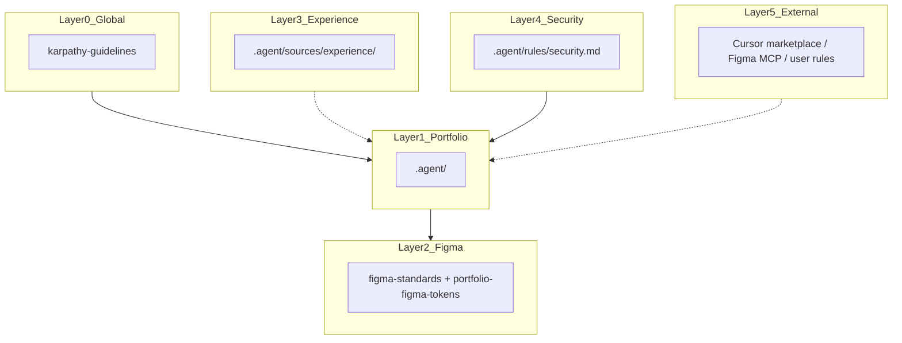

# AI Sources — Layer Index

**Source: Layer 1 — Portfolio** (master segregation doc)

Single reference for where AI rules, skills, and commands come from. Load layers in order: **Global → Portfolio → task-specific**.

---

## Layer diagram



---

## When to load what

| Task | Layers | Files |
|------|--------|-------|
| Any code change | 0, 1 | `.cursor/rules/00-karpathy-guidelines.mdc`, `.agent/rules/design-system.md`, `.agent/rules/` |
| New section / component | 0, 1 | + `@portfolio-feature`, `.agent/context.md` |
| Figma / token sync | 0, 1, 2 | + `.agent/figma-standards.md`, `@portfolio-figma-tokens` |
| PR self-review | 0, 1, 4 | + `.agent/commands/review-pr.md`, `.agent/PR_CODE_QUALITY_CHECKLIST.md` |
| Trace workflow origins | 3 | `.agent/sources/experience/README.md` |
| Security-sensitive change | 0, 1, 4 | + `.agent/rules/security.md` |
| Optional marketplace help | 5 | See External table below |

---

## Provenance table

| File / asset | Layer | Upstream |
|--------------|-------|----------|
| `.agent/sources/karpathy/CLAUDE.md` | 0 — Global | [multica-ai/andrej-karpathy-skills](https://github.com/multica-ai/andrej-karpathy-skills) (MIT) |
| `.cursor/rules/00-karpathy-guidelines.mdc` | 0 — Global | Pointer to karpathy vendored copy |
| `.agent/rules/design-system.md` | 1 — Portfolio | This repo (canonical design system) |
| `.agent/context.md` | 1 — Portfolio | This repo |
| `.agent/figma-standards.md` | 2 — Figma | This repo (designer handoff) |
| `.agent/skills/portfolio-figma-tokens.md` | 2 — Figma | This repo |
| `figma-tokens.json` | 2 — Figma | Tokens Studio export |
| `.agent/hooks/post-agent-typecheck.sh` | 3 — Experience | Pattern from cris-frontend (npm-adapted) |
| `.agent/commands/*` | 3 — Experience | Pattern from cris-frontend (portfolio-scoped) |
| `.agent/PR_CODE_QUALITY_CHECKLIST.md` | 3 — Experience | Shape from cris-frontend (portfolio-scoped) |
| `.agent/sources/experience/README.md` | 3 — Experience | Provenance doc; upstream: cris-frontend |
| `.agent/rules/security.md` | 4 — Security | Adapted from cris-frontend security (static-site scope) |
| Senior FE / Create rule / Figma MCP skills | 5 — External | Cursor marketplace / MCP — not vendored |

**Naming:** Layer 3 is **Experience** (professional-work patterns). `cris-frontend` appears only as an upstream path in Experience provenance — never as a layer label.

---

## Load order (Claude Code)

```
@.agent/sources/karpathy/CLAUDE.md   # Layer 0
@.agent/README.md                    # Layer 1 ops
@.agent/rules/*                      # Layer 1 + 4
@.agent/skills/* (on demand)         # Layer 1–2
CLAUDE.md                            # Root entry
```

Layer 3 — Experience: read `.agent/sources/experience/README.md` when tracing provenance only.

---

## Layer 5 — External (reference only)

| Source | Type | Action |
|--------|------|--------|
| Cursor marketplace (Senior FE, Create rule, etc.) | External | Install per user; not copied into repo |
| Figma MCP plugin skills | External | Enable MCP server |
| User Cursor rules (`~/.cursor/rules`) | Global user | Out of repo scope |

---

## Maintenance rules

1. Add new standards to `.agent/` first, then add a `.cursor/rules/*.mdc` pointer.
2. Update this file when adding layers, sources, or skills.
3. Do not duplicate Karpathy or Experience product-domain rules into `.agent/rules/design-system.md`.
4. Each `.agent/` file should start with `Source: Layer X — {name}`.
